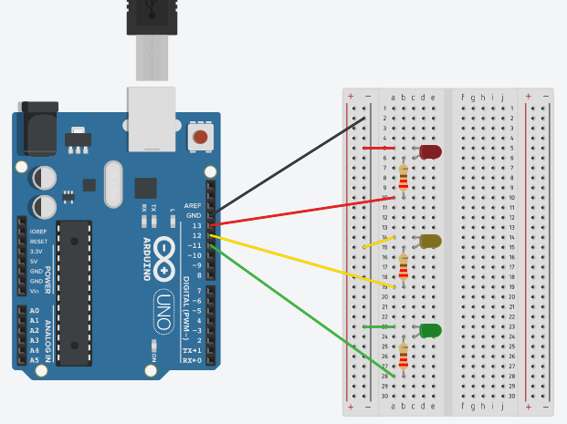
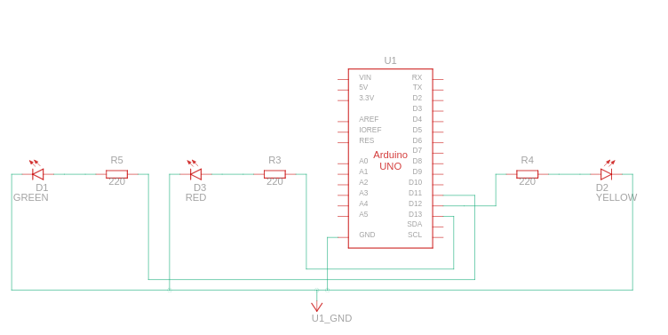

# Práctica 3. EXPERIMENTACIÓN CON ARDUINO

Estudiantes:

- :bust_in_silhouette:  **Santiago Gil Legaza** :octocat: [Repositorio PDIH](https://github.com/Gogilga/PDIH)
- :bust_in_silhouette:  **Victoria Dueñas Salcedo** :octocat: [Repositorio PDIH](https://github.com/vduesal/PDIH)

## 1. Parpadeo led

Implementar el programa de parpadeo de LED, ampliándolo para que encienda y apague alternativamente tres LEDs (uno rojo, otro amarillo y otro verde), conectados a las salidas digitales 11, 12 y 13 del Arduino, a un intervalo de 1.5 segundos. Crear el esquema con Fritzing y cargar el programa en Arduino para comprobar que funciona correctamente.

Componentes eléctricos utilizados: 
- Un LED rojo
- Un LED amarillo
- Un LED verde
- Tres resistencias de 220Ω
- Una placa Arduino Uno R3

Esquema de conexiones eléctricas:





Código fuente:

```
void setup()
{
  pinMode(11, OUTPUT);
  pinMode(12, OUTPUT);
  pinMode(13, OUTPUT);
}

void loop()
{
  digitalWrite(11, HIGH);
  delay(1500); // Wait for 1500 millisecond(s)
  digitalWrite(11, LOW);
  delay(1500); // Wait for 1500 millisecond(s)
  digitalWrite(12, HIGH);
  delay(1500); // Wait for 1500 millisecond(s)
  digitalWrite(12, LOW);
  delay(1500); // Wait for 1500 millisecond(s)
  digitalWrite(13, HIGH);
  delay(1500); // Wait for 1500 millisecond(s)
  digitalWrite(13, LOW);
  delay(1500); // Wait for 1500 millisecond(s)
}
```

## 2. Parpadeo led con pulsador