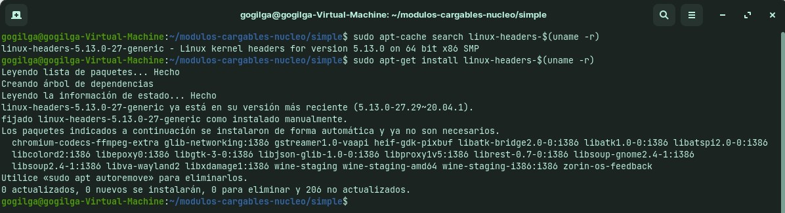
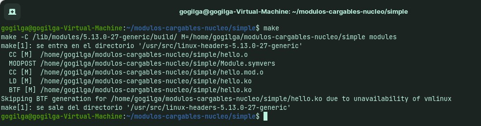
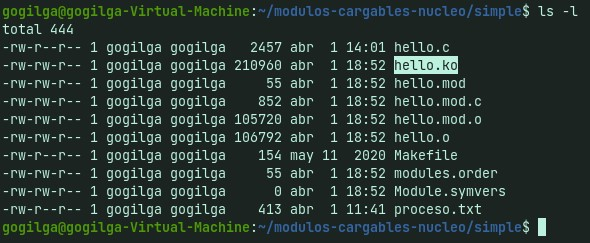
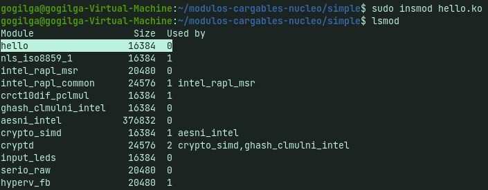
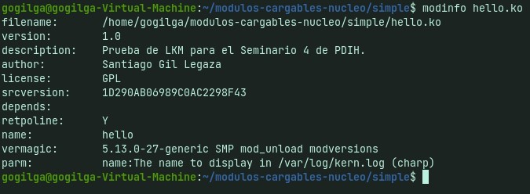
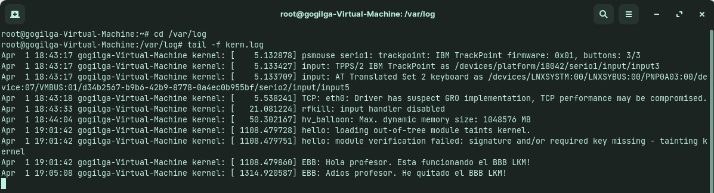

# S-LKM 

Para la realización de esta actividad he usado una máquina virtual con el sistema operativo ``Zorin OS`` instalado.

Primero tenemos que tener preparado el código kernel para compilar un LKM, y para ello instalamos las cabeceras de Linux:
~~~
sudo apt-get update
sudo apt-cache search linux-headers-$(uname -r)
sudo apt-get install linux-headers-$(uname -r)
~~~

Aquí podemos ver la instalación:

En mi caso podemos ver que ya estaba todo lo necesario instalado, por lo que el sistema no hace ningún cambio en los archivos.

El código que he utilizado para el documento `hello.c` es el siguiente:

~~~
#include <linux/init.h>             // Macros used to mark up functions e.g., __init __exit
#include <linux/module.h>           // Core header for loading LKMs into the kernel
#include <linux/kernel.h>           // Contains types, macros, functions for the kernel

MODULE_LICENSE("GPL");              ///< The license type -- this affects runtime behavior
MODULE_AUTHOR("Santiago Gil Legaza");      ///< The author -- visible when you use modinfo
MODULE_DESCRIPTION("Prueba de LKM para el Seminario 4 de PDIH.");  ///< The description -- see modinfo
MODULE_VERSION("1.0");              ///< The version of the module

static char *name = "profesor";        ///< An example LKM argument -- default value is "world"
module_param(name, charp, S_IRUGO); ///< Param desc. charp = char ptr, S_IRUGO can be read/not changed
MODULE_PARM_DESC(name, "The name to display in /var/log/kern.log");  ///< parameter description

/** @brief The LKM initialization function
 *  The static keyword restricts the visibility of the function to within this C file. The __init
 *  macro means that for a built-in driver (not a LKM) the function is only used at initialization
 *  time and that it can be discarded and its memory freed up after that point.
 *  @return returns 0 if successful
 */
static int __init helloBBB_init(void){
   printk(KERN_INFO "EBB: Hola %s. Esta funcionando el BBB LKM!\n", name);
   return 0;
}

/** @brief The LKM cleanup function
 *  Similar to the initialization function, it is static. The __exit macro notifies that if this
 *  code is used for a built-in driver (not a LKM) that this function is not required.
 */
static void __exit helloBBB_exit(void){
   printk(KERN_INFO "EBB: Adios %s. He quitado el BBB LKM!\n", name);
}

/** @brief A module must use the module_init() module_exit() macros from linux/init.h, which
 *  identify the initialization function at insertion time and the cleanup function (as
 *  listed above)
 */
module_init(helloBBB_init);
module_exit(helloBBB_exit);
~~~

Ahora compilamos el archivo fuente `hello.c` para obentener un archivo objeto de kernel del tipo `hello.ko`. Para ello usamos un makefile facilitado por el profesor que incluye lo siguiente:

~~~
obj-m+=hello.o
all:
   make -C /lib/modules/$(shell uname -r)/build/ M=$(PWD) modules
clean:
   make -C /lib/modules/$(shell uname -r)/build/ M=$(PWD)
clean
~~~

Posteriormente añadimos el nuevo módulo en el kernel del sistema operativo.

- Con ``sudo insmod hello.ko`` lo añadimos.
- Con `lsmod` mostramos los diferentes módulos del kernel y podemos ver que está *hello*, que es el que hemos añadido.

A continuación solicitamos información sobre el módulo con `modinfo`:

Finalmente, lo eliminamos del kernel ``rmmod`` y revisaremos la salida de la función *printk()* en el registro de log del kernel:

Al final de la imagen anterior podemos ver como se han mostrado los dos mensajes, uno al haberlo añadido y el último al eliminarlo.