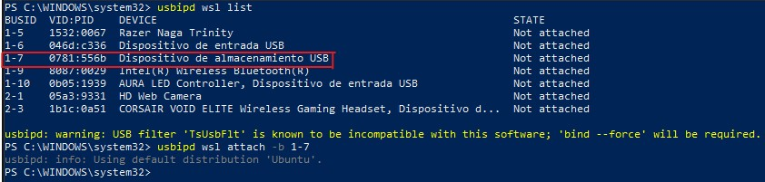
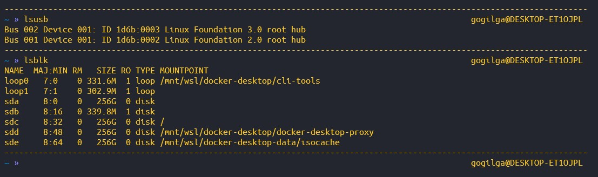
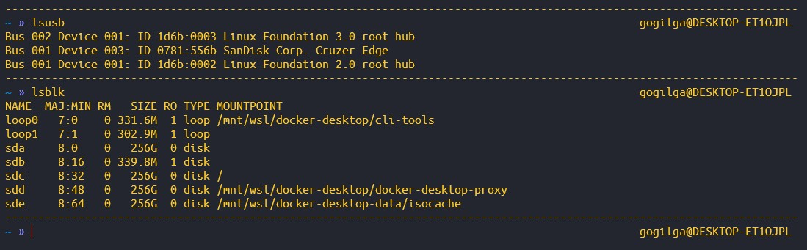
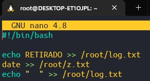
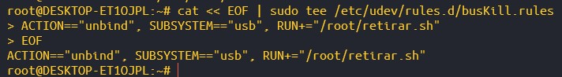
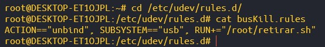
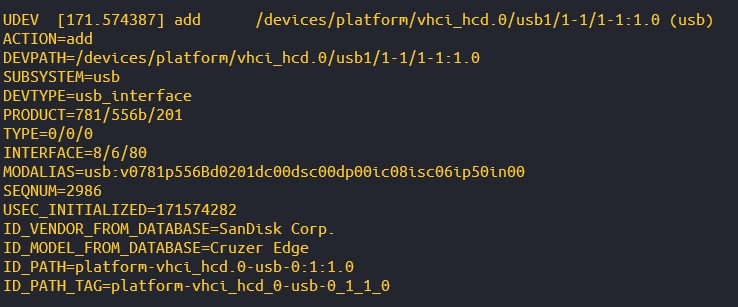
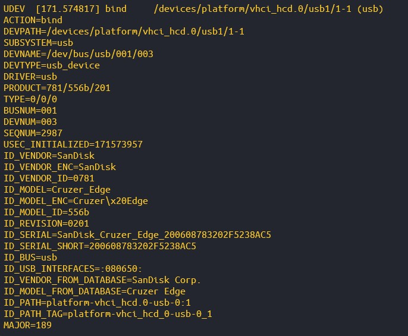
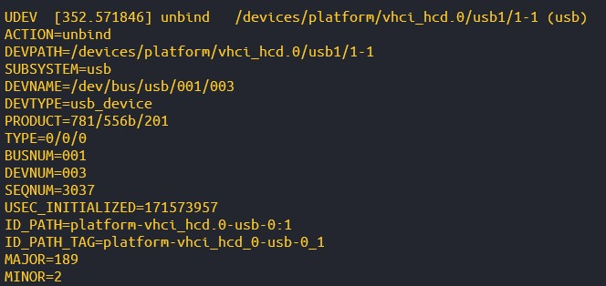
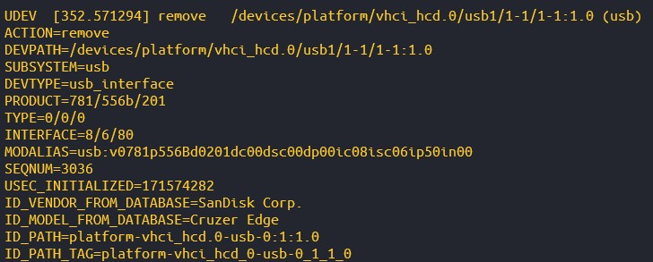

# S-reglas-udev

## 1. Uso de USB en wsl2.

Para la realización de esta actividad he usado wsl2, que es el subsitema de Linux en Windows.

Para que este pueda leer el usb que incorporo en el sistema debo incluir unos comandos mediante el ``Power Shell`` que sirven para introducir el USB en el subsistema de linux.



Ahí podemos ver recuadrado en rojo el dispositivo que quiero usar. Así que con el comando ``usbipd wsl attach -b 1-7`` hago como una introducción del dispositivo en el sistema linux que tenemos en la wsl2.

Podemos comprobar en las siguientes imágenes como se ve el cambio de introducir el usb.





A partir de ahora  ya puedo realizar la práctica con normalidad.

## 2. Archivo de extensión .rules detallando el evento que queremos comprobar y la acción a realizar, y recarga de los archivos de reglas.

Aquí podemos ver el script creado que realizará la acción cuando se retire el dispositivo USB.



En la siguiente capruta se ve el archivo que creamos con extensión ``.rules``.





Ahora reiniciamos el servicio usando:

```
sudo udevadm control --reload
```

## 3. Visualizar en tiempo real los eventos, conectando y desconectando un dispositivo USB

### Add



### Bind



### Unbind



### Remove

